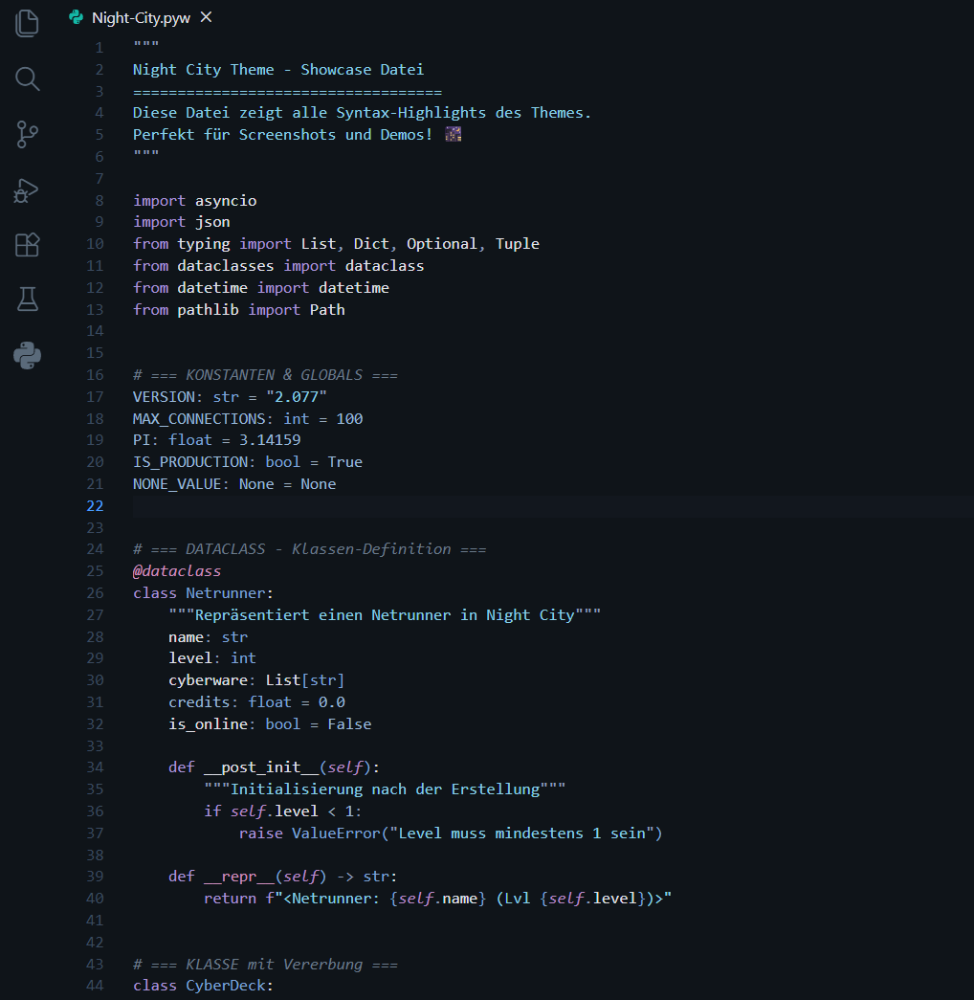
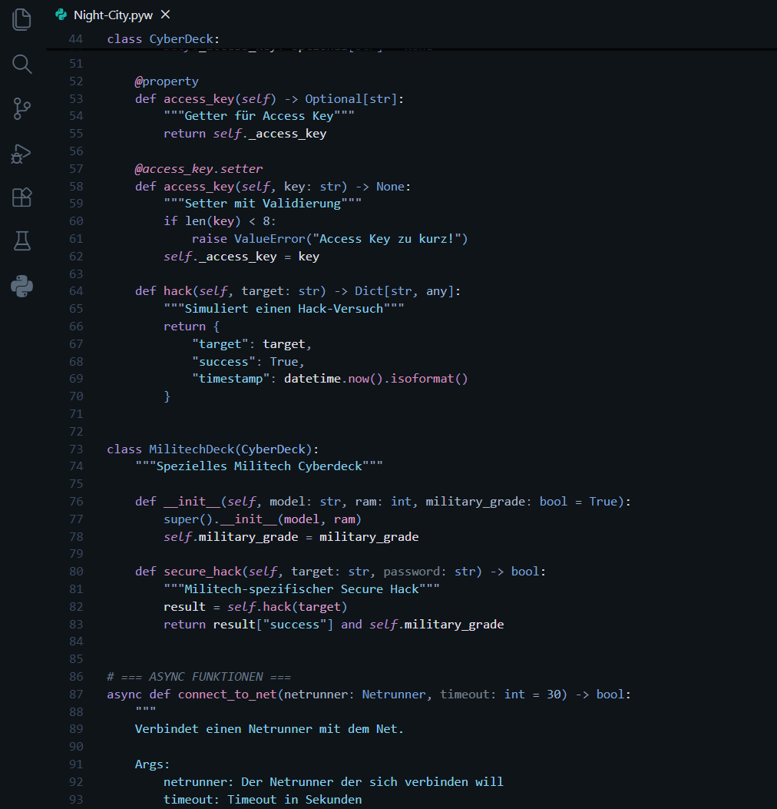
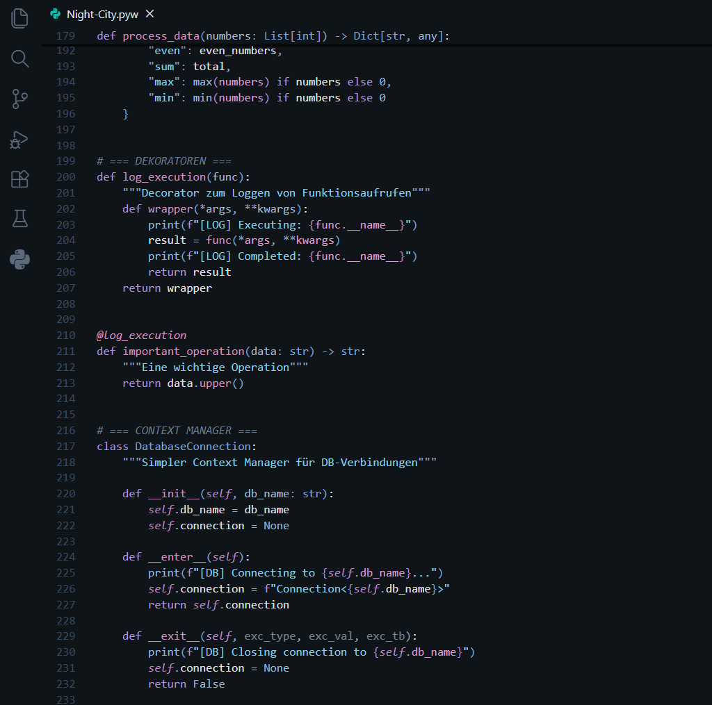

<p align="center">
  
</p>

<h1 align="center">
  
```
███╗   ██╗██╗ ██████╗ ██╗  ██╗████████╗     ██████╗██╗████████╗██╗   ██╗
████╗  ██║██║██╔════╝ ██║  ██║╚══██╔══╝    ██╔════╝██║╚══██╔══╝╚██╗ ██╔╝
██╔██╗ ██║██║██║  ███╗███████║   ██║       ██║     ██║   ██║    ╚████╔╝ 
██║╚██╗██║██║██║   ██║██╔══██║   ██║       ██║     ██║   ██║     ╚██╔╝  
██║ ╚████║██║╚██████╔╝██║  ██║   ██║       ╚██████╗██║   ██║      ██║   
╚═╝  ╚═══╝╚═╝ ╚═════╝ ╚═╝  ╚═╝   ╚═╝        ╚═════╝╚═╝   ╚═╝      ╚═╝   
```

</h1>

<p align="center">
  <strong>A dark cyberpunk theme for Visual Studio Code</strong>
</p>

<p align="center">
  
  
  
</p>

---

## About

The neon lights still flicker, rain lies heavy on the asphalt, and your editor wakes up with you.  
**Night City** is a VS Code theme for long nights, short sleep, and code that lives in the glow of neon colors.  
Cool darkness, sharp contrasts, and synthetic accents straight into your workflow.

**Keywords** shine like neon signs above the streets,  
**Comments** fade into the haze of steaming sewers,  
**Strings** cut through the noise - precise, calm, uncompromising.

## Features

- **Carefully crafted color palette** with cyberpunk aesthetics 
- **Easy on the eyes** for those long coding sessions
- **High contrast** where it matters, subtle where it doesn't
- **Neon accents** that make your syntax pop
- **Full UI integration** - not just editor colors
- **Optimized for modern languages** - JavaScript, Python, TypeScript, and more

## Screenshots







## Installation

### From VS Code Marketplace

1. Open **VS Code**
2. Go to **Extensions** (`Ctrl+Shift+X` / `Cmd+Shift+X`)
3. Search for **"Night City"**
4. Click **Install**
5. Activate the theme with `Ctrl+K Ctrl+T` (or `Cmd+K Cmd+T` on Mac) and select **Night City**

## Who is this for?

Night City is for everyone with chrome in their eyes, coding till midnight.  
For netrunners and all those who want to jack their code into the system with style, whether you're hunting down a bug or planning your next big hack.

Cut out the noise. Crank up the contrast.  
**Welcome to Night City.**

---

## Contributing

> Found a glitch? Wouldnt suprise me. This repository contains 20% logic, 30% caffeine and 50% "why does this suddenly work?"  
> It works on my machine and thats what matters. (I hope someone finds the "Militech" Easter Egg in this Theme.)

Want to suggest improvements?  
Feel free to open an issue or submit a pull request on Github.

---

## Thanks

I especially recommend these Guides if you would like to design youre own VSCTheme:

- [Theme Authoring Guide](https://code.visualstudio.com/api/extension-capabilities/theming)
- [Theme Color Reference](https://code.visualstudio.com/api/references/theme-color)

But there are also really good Tutorials if you dont like reading.

---

## License

This theme is licensed under the [MIT License](LICENSE).

---

<div align="center">

### Stay sharp. See you in the major leagues.

</div>
